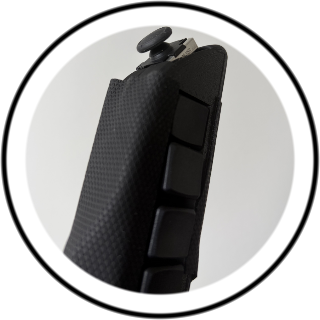

# ScriberEditor

**The open-source word processor for Scriber — a novel one‑handed chording keyboard controller for Snap Spectacles.**

Scriber is a one‑handed input device that outperforms current AR text‑entry methods (the Spectacles virtual keyboard, the Meta display‑glasses wristband) on words‑per‑minute. It packs a **full 60‑key keyboard into a single hand** by *chording*: every key is one combination of **analog‑stick direction × pressure‑sensor force × one of four buttons**. **ScriberEditor** is the lens that proves it out — a real, multi‑document word processor for Spectacles that you drive entirely with Scriber.

> Built for the [Snap Spectacles Community Challenge](https://lenslist.co/spectacles-community-challenges) (Open Source category). Also presented at MIT Reality Hack @ AWE 2026. Created by Arthur Ibanda.



## 📹 Demo

<!-- TODO: add your ≤30s challenge demo video + a couple of in‑lens screenshots here -->
_Demo video coming soon — see the [Devpost](https://devpost.com/software/scriber-gd8u4p) and the [challenge thread](https://lenslist.co/spectacles-community-challenges)._

## How Scriber works — 60 keys in one hand

Scriber never needs a second hand or a flat surface. A key is selected by three simultaneous choices:

| Choice | Control | Options |
|---|---|---|
| **Section** | Analog stick direction | 5 zones — `CENTER` (neutral), `TOP` (up), `LEFT`, `RIGHT`, `BOTTOM` (down) |
| **Row / tier** | Pressure‑sensor (FSR) force | 3 tiers — light / rest, medium, firm |
| **Column** | One of four buttons | `Btn1`–`Btn4` |

`5 sections × 3 pressure tiers × 4 buttons = 60 keys` — enough for the full alphabet, digits, symbols, and modifiers (Shift, Caps, Space, Enter, Backspace, Tab, emoji), all reachable without moving your hand. As you tilt and press, the lens **highlights the live selection** so you always see where you are before you commit a key.

The layout is defined once in [`Assets/Scripts/KeyboardLayout.ts`](Assets/Scripts/KeyboardLayout.ts) and mirrors the firmware, so the on‑screen keyboard and the device always agree.

## ScriberEditor — the demo app

ScriberEditor is a complete little word processor, not just a keystroke demo:

- **Multi‑document editor** — create, open, edit, and delete multiple documents; each tracks its own update time.
- **On‑device persistence** — everything saves locally via Lens Studio's persistent storage and survives closing the lens.
- **Optional cloud sync** — bring your own Supabase/snapcloud backend to sync across sessions, publish public docs, and collect "cool" reactions. Falls back seamlessly to **local‑only** when no backend is set.
- **Tabbed UI** — `Editor` · `My Docs` (private) · `All Docs` (public) · `Settings`.
- **Full‑text search** over your document titles.
- **Scrollable editor** — word wrap, blinking cursor, auto‑scroll to the caret, empty‑state hint.
- **Live virtual keyboard** — an on‑screen mirror of the 60‑key layout that highlights the active section/row and flashes keys on commit. Every key is also **directly tappable** (finger poke, hand‑ray pinch, or controller cursor), so you can type without the Scriber too.
- **Google Drive** — save any doc to Drive as a `.txt`, or open an existing Drive `.txt` from an in‑lens picker. Google sign‑in via Snap's Auth Kit (OAuth in the Spectacles App — see `docs/GOOGLE-DRIVE.md`).
- **Auto‑save** — saved docs persist after ~1.5 s idle; new drafts save on demand with a private/public prompt.
- **Hands‑light navigation** — a yellow focus ring moves between buttons and cards via the stick, activated by a button press or a pinch.
- **Customizable** — swap keys live and adjust font size (24–52 pt) from Settings.

## Try it without hardware (simulator)

Don't have a Scriber built yet? ScriberEditor ships with an **in‑lens simulator** that synthesizes commit packets, so you can explore the whole editor in Lens Studio's preview with no device connected. Everything below about pairing is only needed to drive it with the real controller.

## The Scriber device

Scriber is a **custom BLE peripheral** built on a **nice!nano v2 (nRF52840)** running CircuitPython. It deliberately does **not** use standard HID‑over‑GATT — it exposes one custom, **open (no pairing / no encryption)** service with two notify characteristics:

- **`state`** — the live section/row selection, so the lens can highlight where you are.
- **`commit`** — the actual key press, when a button commits.

Skipping HID encryption is what lets Lens Studio's `BluetoothCentralModule` connect and subscribe directly. (The Scriber firmware and the full GATT wire format are kept in a separate private repo.)

> The lens prefers the custom Scriber service but **falls back to a standard BLE HID keyboard** (`0x1812`) if that's what it finds — so a plain BLE HID keyboard works too.

## Requirements

- **Snap Spectacles**
- **Lens Studio** (5.x — see `ScriberEditor.esproj` for the exact build) with **Experimental API enabled** (required for the Bluetooth API).
- [Git LFS](https://git-lfs.com) — this repo stores `Assets/**` and `Packages/**` via LFS.
- *(Optional, for real hardware)* a **Scriber** controller — a nice!nano v2 flashed with the Scriber firmware (kept in a separate private repo; available on request).

## Getting started

```bash
git lfs install
git clone https://github.com/Altomand/ScriberEditor.git
cd ScriberEditor
```

1. Open the project in **Lens Studio**.
2. Project Settings → enable **Experimental API**.
3. To run **without hardware**, use the built‑in simulator and just Preview / send to Spectacles.
4. To use a **real Scriber**: on the `BleKeyboard` component set `keyboardName` to your device's advertised BLE name (default `Skywriter`), connect Spectacles to Lens Studio, **Send to Spectacles**, then power on Scriber — it connects automatically.

### Optional: cloud sync (bring your own Supabase)

Cloud sync is **off by default and not required** — the app runs fully local‑only. The specific backend asset is intentionally **not** committed (it holds a project URL + token). To enable sync with your own backend:

1. Create a Supabase (snapcloud) project with `documents` and `document_cools` tables.
2. In Lens Studio add a **Supabase Project** asset with your project URL + public token.
3. Assign it to the `supabaseProject` input on `CloudDocumentStore`, and wire that store into `DocumentManager`'s `cloudStore` input. Leave `cloudStore` empty to stay local‑only.

## Project structure

```
Assets/Scripts/
  BleKeyboard.ts          BLE connect; custom Scriber service (+ HID fallback) & decoding
  BleKeyboardAdapter.ts   Bridges keyboard events into the UI
  KeyboardLayout.ts       The 60-key section/row/button layout + selection model
  VirtualKeyboard.ts, KeyboardLayoutEditor.ts, LayoutOverrides.ts   On-screen keyboard + live remap
  InputModeManager.ts     Navigation vs. typing mode lock
  FocusNavigator.ts, HighlightRing.ts   Stick/pinch focus-ring navigation
  DocumentManager.ts      Central document state; routes input; local + cloud stores
  DocumentTypes.ts        DocumentStore interface + shared types
  LocalDocumentStore.ts   On-device persistence
  CloudDocumentStore.ts   Optional Supabase/snapcloud store (bring your own backend)
  DocsListController.ts, DocumentPanelController.ts, EditorTabController.ts   Docs UI + tabs
  GoogleDriveStore.ts     AuthKit OAuth2 + Google Drive REST (save/list/download .txt)
  GoogleDrivePanel.ts     Popup: Google sign-in, Drive file picker, status
  ScrollableTextEditor.ts, ScrollAdapter.ts   Scrolling text view
  SearchController.ts, SettingsController.ts, SimpleDropdown.ts, UiUtil.ts, Event.ts
```

## Known issues

- Unsaved writing is lost on close; new drafts need a manual **Save** before auto‑save applies.
- Cloud sync is last‑write‑wins — concurrent edits to one doc from two devices can clobber.
- Emoji keys are defined in the layout but don't yet render/commit output (TODO).
- No text selection or cursor movement yet — the editor is append/backspace only.

## Roadmap

- Emoji rendering, richer editing, cursor/selection.
- More layouts and refined chording ergonomics.
- Smoother multi‑device sync / conflict handling.

## Credits & attribution

ScriberEditor is adapted from **[Spectacles‑SkywriterBLE](https://github.com/IoTone/Spectacles-SkywriterBLE)** by **IoTone, Inc.** — the open‑source lens that first demonstrated driving a BLE keyboard on Snap Spectacles, and which this project's BLE input layer builds on. Thank you for that groundwork.

- Inspiration: Doublepoint Touch SDK; Snap's BLE sample.
- Audio: [BryanSaraiva on freesound.org](https://freesound.org/people/BryanSaraiva/sounds/820352/).

## License

Released under the [MIT License](LICENSE.md). © 2026 Arthur Ibanda.
